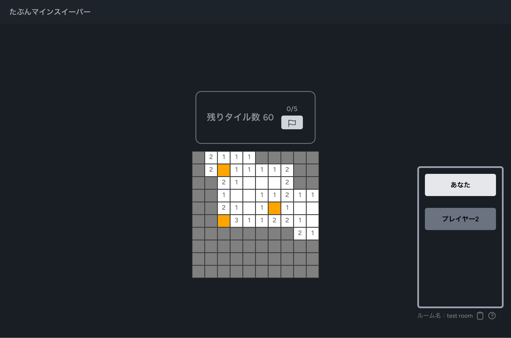
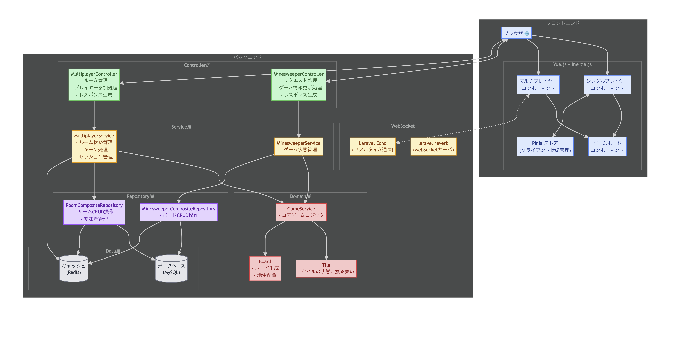

# 現在（2026年1/27）サーバーコスト節約のため停止中

# たぶんマインスイーパー - オンラインマルチマインスイーパー

リアルタイムで複数人が協力して遊べる、オンラインマルチプレイ対応のマインスイーパーです。  
WebSocket を用いて、各プレイヤーの操作が即時に同期される設計になっています。

### プレイ画像



---

## ゲームプレイはこちらから

[▶️ アプリケーションはこちら](https://maybe-minesweeper-main-ty9rtx.laravel.cloud/)

### 遊び方

1. ゲームモード「マルチプレイ」を選択しましょう。
2. 次に「ルーム作成」をクリックして、マルチルームを作成します。
3. マルチプレイを作成すると、自動でルームに参加するので、他のプレイヤーにURLを共有します
4. 「今すぐプレイ」もしくは「ゲームスタート」をクリックすることで、ゲームが開始します。
5. あとは、マインスイーパーをプレイするだけです！

---

## ✨ 特徴

- **リアルタイム同期**：WebSocket によるマルチプレイ対応
- **協力型ゲーム設計**：複数人で地雷を推論しながら進める仕様
- **シンプルUI**：TailwindCSS によるミニマルモダンなデザイン
- **シンプルな認証**：URLの共有だけでルーム参加可能な設計

---

## 🛠 使用技術（Tech Stack）

| 技術             | 用途                |
|----------------|-------------------|
| TypeScript     | 型安全なロジック実装        |
| Vitest         | フロントエンドテスト        |
| Vue 3          | UI構築・コンポーネント設計    |
| Laravel12      | APIおよびWebSocket管理 |
| PHPUnit&Pest   | TDDによる開発          |
| Laravel Reverb | WebSocketサーバー構築   |
| Redis          | ゲーム状態の一時保存        |
| TailwindCSS    | UIデザイン            |
| daisyUI        | UIデザイン            |

---

## 🧱 アーキテクチャ概要

アーキテクチャ図：
[mermaid形式はこちら](./doc/multi_minesweeper_architecture_detail.mmd)


---

## **ローカルセットアップ例**

```bash
# Vue + Inertia の設定
npm install
npm run dev

# バックエンドinit
composer install
php artisan key:generate
 
# マイグレーション
php artisan migrate

# ローカル開発サーバー起動
php artisan serve

# webSocketサーバ起動
php artisan reverb:start
```

---
